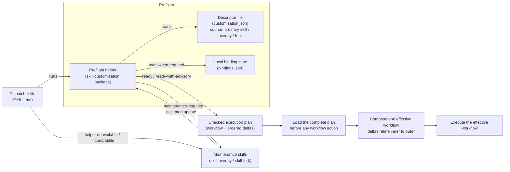

# 🛠️ Skill Customization

Skill Customization provides a reliable way to adapt installed agent skills while keeping custom workflows aligned with improvements from their original sources. It tracks where each skill came from, records intentional changes, and prevents future updates from silently overwriting or breaking customized behavior.

## ⚠️ Core Problems

### 📁 In-Place Edits Disappear

Update-managed source skills can overwrite direct tweaks during their next refresh; read-only sources cannot be edited in place.

- **The fix:** Use a semantic overlay.
- **Mechanism:** Keep the source live and read-only. Layer a documented behavior change beside it.

```text
managed-skills/
└── handoff/
    └── SKILL.md                 # Live, read-only upstream source

customizations/
└── handoff-local-archive/
    ├── SKILL.md                 # Thin dispatcher
    ├── CUSTOMIZATION.md         # Semantic delta from source
    └── customization.json       # Descriptor: portable identity + review
```

### 📉 Full Copies Drift

Full-copy forks become difficult to audit as they drift, lose provenance, or collide with the source skill's name or trigger.

- **The fix:** Capture explicit provenance.
- **Mechanism:** Store a reviewed source snapshot directory alongside an explicit diff file.

```text
managed-skills/
└── incident-response/
    └── SKILL.md                         # Source selected for review

customizations/
└── incident-response-standalone/
    ├── SKILL.md                         # Thin dispatcher
    ├── CUSTOMIZATION.md                 # Complete independent workflow
    ├── customization.json               # Descriptor: portable identity + provenance
    └── provenance/
        ├── source/                      # Reviewed source snapshot directory
        └── source.diff                  # Snapshot → owned payload
```

### 🛑 Multi-Agent Collisions

One logical skill may be active through several agent paths or skill managers at once, making the selected copy uncertain.

- **The fix:** Use evidence-based discovery and binding.
- **Mechanism:** Let the portable descriptor state the expected source identity and fingerprint, then keep the selected concrete path in a context-scoped local binding.

```text
project/.agents/skills/review/                  # Shared candidate
project/.claude/skills/review/                  # Host-specific candidate
~/.codex/skills/review/                         # Personal candidate
~/.skills-manager/.../review/                   # Manager candidate

customizations/review-with-policy/
└── customization.json                       # Descriptor: portable source requirements

$XDG_STATE_HOME/skill-customization/
└── bindings.json                            # Confirmed path for this context
```

## 🎛️ Customization Models

Customization models describe the runtime relationship between a skill and its source.

| Model | Source relationship | Runtime behavior |
| --- | --- | --- |
| `skill-overlay` | Live ordinary skill, verified overlay, or verified fork | Source workflow composed with a semantic delta before execution; source updates remain available |
| `skill-fork` | Reviewed ordinary skill, verified overlay, or verified fork | Complete independent workflow; no live runtime source required |
| Companion skill | Ordinary dependency | Separate workflow that calls or consumes the source; no customization binding |

### Activation Modes

Activation is separate from source relationship: a customization either coexists with the source or intentionally replaces it.

| Mode | Naming | Behavior |
| --- | --- | --- |
| `coexist` | Uses a distinct name | Safe default; keeps the source available |
| `replace` | Uses the source name | Requires deterministic customization-first precedence and separate confirmation |

## 📥 Installation

Install both customization skills with [skills](https://github.com/vercel-labs/skills):

```sh
npx skills@latest add samitoyang/skill-customization
```

Or clone the repository, then symlink the complete skill directories into a skill root supported by the host:

```sh
git clone https://github.com/samitoyang/skill-customization.git
```

```text
skill-customization/
└── skills/
    ├── skill-fork/
    └── skill-overlay/
```

> [!NOTE]
> A symlinked checkout can reuse its local helper after approval. If the skills are just copied to a skill root, an installed helper or the approved registry fallback is still needed.

Optionally pre-install the helper:

```sh
npm install --global skill-customization@latest
```

The helper is a dependency-free Node.js package for deterministic checks and requires Node.js 18 or newer. Compatibility is checked before use. Approval when selecting an on-demand helper covers subsequent helper commands while its recorded identity and state remain unchanged.

## 🌐 Ecosystem Compatibility

### Hosts and roots

The [checkpointed agent registry](https://github.com/vercel-labs/skills/blob/305ff8be68e59368789d765e2cf0edfab851c453/src/agents.ts) covers Codex, Claude Code, GitHub Copilot, Cursor, Gemini CLI, OpenCode, OpenHands, Windsurf, and other hosts through their declared project and personal roots.

| Root type | Representative paths |
| --- | --- |
| Shared project | `.agents/skills` |
| Host-specific project | `.claude/skills`, `.github/skills`, `.cursor/skills`, `.windsurf/skills` |
| Personal | `~/.agents/skills`, `~/.claude/skills`, `$CODEX_HOME/skills` |
| Configured | Claude `additionalDirectories`, `COPILOT_SKILLS_DIRS`, manager-owned roots, explicit custom paths |

### Skill managers

Discovery understands metadata from:

- [skills](https://github.com/vercel-labs/skills) v3 lock metadata
- [asm](https://github.com/luongnv89/asm)
- [Skills Manager](https://github.com/xingkongliang/skills-manager)
- [skillsmgr](https://github.com/jtianling/skills-manager)

> [!NOTE]
> Compatibility means declared roots and metadata can be discovered. It does not imply that every host loads or executes skills identically.

## 💬 Usage

### Explicit Skill Invocations

Invoke a skill without a trailing prompt to start interactive creation:

```text
/skill-overlay
/skill-fork
```

Or include an initial request:

```text
/skill-overlay customize handoff so every result is archived locally
/skill-fork make incident-response independent of its original checkout
```

Explicit invocation and automatic model selection enter the same creation process.

### Natural Language Prompts

- “Customize handoff so every result is archived locally, while keeping upstream updates.”
- “Make incident-response independent of its original checkout.”
- “Create a separate review skill that still calls the original.”
- “Run my existing customized handoff workflow.”

### After Creation

- **Destination:** New workspace customizations use `.agents/skills/<name>/` by default. During creation, a compatible host-specific project root or personal skill root may be selected instead.

- **Relocation:** Move the entire customization directory to another supported skill root, then reload the agent host. In a different workspace, an overlay requires source confirmation before running; a fork continues independently.

## 📋 Creation Workflow

The creation phase can begin with a bare invocation, a known source and customization idea, or existing artifacts. Helper-assisted discovery inventories available evidence and asks only for unresolved decisions. Existing artifacts count as prior intake, and any overlay/fork mismatch is explained before changes are made.

Before artifacts are written or a binding is created, one brief confirms the complete customization boundary:

| Input | Confirms |
| --- | --- |
| Skill name, repository, or path | One concrete source and its evidence |
| Behavior and completion criteria | Desired behavior, preserved behavior, non-goals, and observable success |
| Updates or independence | Overlay or fork |
| Name and activation | Coexist or explicit replacement |
| Workspace context | Destination, binding scope, and directory boundaries |
| License and provenance | Review and redistribution evidence |
| Helper access | Whether to use an installed helper or approve an on-demand local or registry helper |

> [!IMPORTANT]
> Same-name replacement requires separate confirmation because it changes which skill activates.

## 🧭 Runtime Workflow

After creation, every invocation follows a checked runtime path. The graph distinguishes portable files, local state, installed tooling, and runtime instructions.



| Graph component | Artifact | Responsibility |
| --- | --- | --- |
| Dispatcher file | `SKILL.md` | Selects a compatible helper and starts preflight |
| Descriptor file | `customization.json` | Stores portable identity, source requirements, and reviewed fingerprints |
| Local binding state | `bindings.json` | Stores the concrete source path for one context when required |
| Preflight helper | `skill-customization` package | Validates local evidence and returns checked runtime instructions or a maintenance stop |
| Runtime instructions | Source `SKILL.md` and customization `CUSTOMIZATION.md` files | Load the full checked plan, compose the base or fork workflow with inner-to-outer deltas before any action, then execute the effective workflow |
| Maintenance skills | `skill-overlay` or `skill-fork` | Handle creation, drift, repair, incompatible setup, and explicit maintenance |

A ready customization executes its checked runtime instructions directly without invoking a maintenance skill.

## 🛡️ Security and Provenance

| Boundary | Guarantee |
| --- | --- |
| Resolved source | Read-only input with a symlink-free fingerprinted target tree that excludes clone-local version-control metadata; top-level installation aliases resolve to their canonical target |
| Portable descriptor | Stable identity, own/source licenses, relative artifacts, reviewed fingerprints, and activation; runtime selectors stay inside the reviewed owned payload and no concrete source paths are stored |
| Local state | Context-scoped bindings and compatibility decisions remain private and are written atomically; maintenance locks are canonically contained and portable descriptor/diff modes are preserved |
| Helper execution | Checkout metadata identifies but does not authenticate a local candidate; approval when selecting an on-demand helper covers subsequent commands only while its recorded identity and state remain unchanged |
| Overlay | Live context binding, reviewed owned payload, and full-source or customization-source effective fingerprint |
| Fork | Runtime leaf with complete workflow and a relative, symlink-free snapshot directory and diff beneath reserved `provenance/` |

Published descriptors keep stable identity and provenance portable. Concrete source paths, credentials, bindings, and compatibility decisions remain local. The supporting Node.js package has no runtime dependencies.

## 📚 References

- For direct helper use, read the [CLI reference](docs/cli.md); `skill-customization --help` is authoritative for commands and options.
- For Node.js/npm prerequisites, lifecycle helper negotiation, canonical rendering, local-code execution approval, registry download/cache permission, package selection, and compatibility guarantees, read [Helper contract 2](docs/helper-contract-2.md). [Helper contract 1](docs/helper-contract-1.md) remains supported for existing dispatchers.
- For publishable identity and activation fields, read [Descriptor v1](docs/descriptor-v1.md).
- For roots, evidence order, source selection, and local state, read [Discovery and bindings](docs/discovery-and-bindings.md).
- For overlay drift and fork-payload verification, read [Reconciliation](docs/reconciliation.md).
- For embedding the engine in another Node.js tool, read the [Library reference](docs/library.md).
- For the runtime decision, read [ADR 0001](docs/adr/0001-managed-recursive-runtime.md).
- For vulnerability reporting and release history, see [Security](SECURITY.md) and the [Changelog](CHANGELOG.md).
