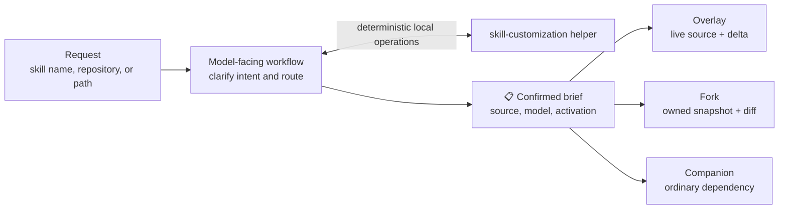

# 🛠️ Skill Customization

Skill Customization provides a rock-solid, production-grade layer to adapt installed agent skills safely—tracking their origins, documenting changes, and preventing architectural breakage when upstream sources move forward.

## ⚠️ Core Problems

### 📁 In-Place Editing Faults

Update-managed source skills can overwrite direct tweaks during their next refresh; read-only sources cannot be edited in place.

- **The fix:** Use a semantic overlay.
- **Mechanism:** Keep the source live and read-only. Layer a documented behavior change beside it.

```text
managed-skills/
└── handoff/SKILL.md                 # Live, read-only upstream source

customizations/
└── handoff-local-archive/           # Documented delta + descriptor
```

### 📉 Full Copy Drifts

Full-copy forks become difficult to audit as they drift, lose provenance, or collide with the source skill's name or trigger.

- **The fix:** Capture explicit provenance.
- **Mechanism:** Store a reviewed source snapshot alongside an explicit diff file.

```text
incident-response-standalone/
├── customization.json
├── SKILL.md
└── provenance/
    ├── source/                      # Reviewed snapshot
    └── source.diff                  # Snapshot → owned payload
```

### 🛑 Multi-Agent Collisions

One logical skill may be active through several agent paths or skill managers at once, making the selected copy uncertain.

- **The fix:** Use evidence-based discovery and binding.
- **Mechanism:** Keep identical names distinct, resolve collisions, and scan each physical root once.

```text
project/.agents/skills/review        # Shared agent path
project/.claude/skills/review        # Host-specific path
~/.codex/skills/review               # Personal path
~/.skills-manager/.../review         # Manager path
```

## 🎛️ Customization Models

| Model | Desired outcome | Architectural behavior |
| --- | --- | --- |
| `skill-overlay` | Keep receiving source improvements and add a documented behavior change | Retains a live source connection |
| `skill-fork` | Own an independent skill that works without the source checkout | Owns its snapshot and diff payload |
| Companion skill | Build a separate skill that only calls or consumes the source | Requires no customization binding |

### Activation Modes

| Mode | Naming | Behavior |
| --- | --- | --- |
| `coexist` | Uses a distinct name | Safe default; keeps the source available |
| `replace` | Uses the source name | Requires deterministic customization-first precedence and separate confirmation |

## 📥 Installation

Install both bundled workflow models with [skills](https://github.com/vercel-labs/skills):

```sh
npx skills@latest add samitoyang/skill-customization
```

Or install one explicit workflow model:

```sh
npx skills@latest add samitoyang/skill-customization --skill skill-overlay
npx skills@latest add samitoyang/skill-customization --skill skill-fork
```

Both skills are independently installable. Natural-language requests can select them automatically, and explicit slash invocation remains available.

### Ecosystem Compatibility

**Supported hosts.** The [checkpointed agent registry](https://github.com/vercel-labs/skills/blob/305ff8be68e59368789d765e2cf0edfab851c453/src/agents.ts) covers Codex, Claude Code, GitHub Copilot, Cursor, Gemini CLI, OpenCode, OpenHands, Windsurf, and other hosts through their declared project and personal roots.

| Root type | Representative paths |
| --- | --- |
| Shared project | `.agents/skills` |
| Host-specific project | `.claude/skills`, `.github/skills`, `.cursor/skills`, `.windsurf/skills` |
| Personal | `~/.agents/skills`, `~/.claude/skills`, `$CODEX_HOME/skills` |
| Configured | Claude `additionalDirectories`, `COPILOT_SKILLS_DIRS`, manager-owned roots, explicit custom paths |

**Supported manager metadata:**

- [skills](https://github.com/vercel-labs/skills) v3 lock metadata
- [asm](https://github.com/luongnv89/asm)
- [Skills Manager](https://github.com/xingkongliang/skills-manager)
- [skillsmgr](https://github.com/jtianling/skills-manager)

> [!NOTE]
> Compatibility means declared roots and metadata can be discovered. It does not imply that every host loads or executes skills identically.

## 💬 Usage

### Natural Language Prompts

- “Customize handoff so every result is archived locally, while keeping upstream updates.”
- “Make incident-response independent of its original checkout.”
- “Run my existing customized handoff workflow.”

### Explicit Skill Invocations

```text
/skill-overlay customize handoff so every result is archived locally
/skill-fork make incident-response independent of its original checkout
```

Both skills retain model discovery and explicit user invocation; explicit invocation follows the same workflow rather than enabling a separate mode.

## 🧭 Customization Workflow

`skill-overlay` and `skill-fork` are model-facing workflows: they interpret intent, gather decisions, and enforce gates. The `skill-customization` helper is their deterministic engine for local evidence and reproducible operations.



| Stage | Model-facing workflow | Helper |
| --- | --- | --- |
| Resolve a source hint | Clarify the outcome and unresolved choices | Search declared roots and bounded workspace ancestors; inspect metadata; group installed copies and provenance |
| Create an overlay | Confirm the delta, live-source relationship, name, activation, and context | Validate, bind one confirmed source, fingerprint both sides, and reconcile |
| Run an existing overlay | Follow the live workflow and apply the documented delta | Revalidate the binding; stop on ambiguous, incompatible, or absorbed upstream changes |
| Create or verify a fork | Confirm independence, license, owned provenance, and activation | Validate the snapshot and diff; prove they reproduce the complete fork payload without a live runtime source |

A companion skill uses an ordinary dependency and needs no customization descriptor or binding.

### 📋 Intake and Confirmed Brief

Provide a source and customization idea when they are known. For partial or empty requests, the workflow inventories evidence and asks only for unresolved decisions. Existing artifacts remain stored intake, and an overlay/fork mismatch is explained before the workflow changes.

Before helper-backed creation, one brief confirms the complete customization boundary:

| Input | Confirms |
| --- | --- |
| Skill name, repository, or path | One concrete source and its evidence |
| Behavior and completion criteria | Desired behavior, preserved behavior, non-goals, and observable success |
| Updates or independence | Overlay or fork |
| Name and activation | Coexist or explicit replacement |
| Workspace context | Destination, binding scope, and directory boundaries |
| License and provenance | Review and redistribution evidence |
| Helper permission | Whether an on-demand compatibility check may download or reuse cached code |

> [!IMPORTANT]
> Helper-assisted discovery may be used during intake. Confirm the concrete source and activation intent before the first binding; same-name replacement requires separate confirmation.

## 🛡️ Security and Provenance

| Boundary | Guarantee |
| --- | --- |
| Resolved source | Read-only input; customization writes stay outside it |
| Portable descriptor | Stable identity, relative artifacts, provenance, and activation; no credentials or machine-local paths |
| Local state | Context-scoped bindings and compatibility decisions written atomically under a cross-process lock |
| Overlay | Live binding and independent source/customization fingerprints; ambiguous or absorbed drift stops activation |
| Fork | Owned, relative, symlink-free snapshot and diff that must reproduce the complete payload |

Published descriptors keep stable identity and provenance portable. Concrete source paths, credentials, bindings, and compatibility decisions remain local. The supporting Node.js package has no runtime dependencies.

## 📚 References

- For direct helper use, read the [CLI reference](docs/cli.md); `skill-customization --help` is authoritative for commands and options.
- For Node.js/npm prerequisites, helper negotiation, download and cache permission, package selection, and compatibility guarantees, read [Helper contract 1](docs/helper-contract-1.md).
- For publishable identity and activation fields, read [Descriptor v1](docs/descriptor-v1.md).
- For roots, evidence order, source selection, and local state, read [Discovery and bindings](docs/discovery-and-bindings.md).
- For overlay drift and fork-payload verification, read [Reconciliation](docs/reconciliation.md).
- For embedding the engine in another Node.js tool, read the [Library reference](docs/library.md).
- For vulnerability reporting and release history, see [Security](SECURITY.md) and the [Changelog](CHANGELOG.md).

## 🤝 Contributing & License

Contributions are highly valued. Read the [structural guidelines](CONTRIBUTING.md) before proposing workflow extensions.

- **Bug reports:** Include the command, expected and actual behavior, Node.js version, a sanitized `customization.json`, and the exact `stderr` diagnostics.
- **Feature requests:** Describe proposed additions to helper verification or architectural rules, including the public behavior and tests they affect.
- **Code style:** Preserve the deterministic runtime contract, add `node:test` coverage, and run `npm run verify`.

Skill Customization is available under the [MIT License](LICENSE).
